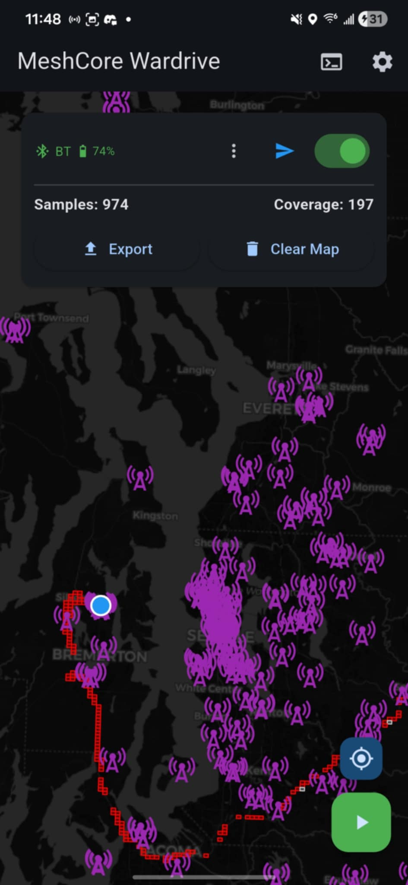
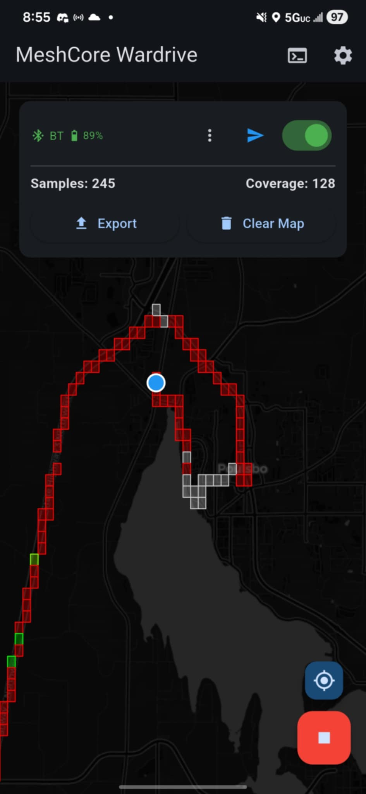
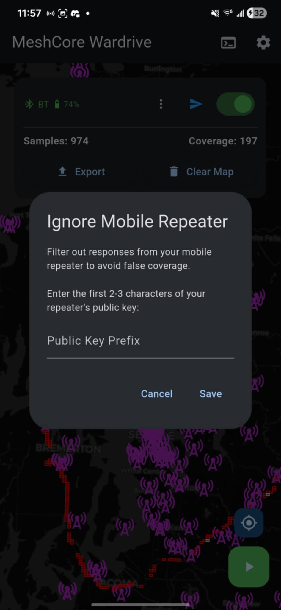

# MeshCore Wardrive

A mobile wardriving application for mapping MeshCore mesh network coverage in real-time.

## 📥 Download

**Latest Release:** [v1.0.7 APK](releases/meshcore_wardrive_v1.0.7.apk) (52.7 MB)

**Previous Versions:**
- [v1.0.6 APK](releases/meshcore_wardrive_v1.0.6.apk) (52.7 MB)
- [v1.0.5 APK](releases/meshcore_wardrive_v1.0.5.apk) (52.7 MB)
- [v1.0.4 APK](releases/meshcore_wardrive_v1.0.4.apk) (52.7 MB)
- [v1.0.3 APK](releases/meshcore_wardrive_v1.0.3.apk) (52.7 MB)
- [v1.0.2 APK](releases/meshcore_wardrive_v1.0.2.apk) (52.6 MB)

## 📸 Screenshots

  
  
  
  

  
  
  
  

## 🚀 Quick Start

1. **Download the APK** from the releases folder
2. **Enable "Install from Unknown Sources"** in your Android settings
3. **Install the APK** on your device
4. **Join #meshwar channel** in the MeshCore app (get QR code from another user)
5. **Connect your LoRa device** via USB or Bluetooth
6. **Start wardriving!**

## ✨ Features

### Mobile App
- **Real-time GPS Tracking** - Background support with screen-lock capability
- **LoRa Device Support** - Connect via USB or Bluetooth to MeshCore companion radios
- **Auto-Ping Mode** - Configurable intervals from 50 meters to 1 mile
- **Manual Ping** - Test coverage at specific locations
- **Success Rate Visualization** - Color-coded coverage map:
  - 🟢 **Green (≥80%)**: Very reliable coverage
  - 🟢 **Yellow-Green (50-80%)**: Usually works
  - 🟡 **Yellow (30-50%)**: Spotty coverage
  - 🟠 **Orange (10-30%)**: Rarely works
  - 🔴 **Red (<10%)**: Dead zone
- **Repeater Discovery** - See which repeaters are in range
- **Data Export** - Save and share your wardrive data
- **Web Map Upload** - Contribute to community coverage map

### Web Map
View the live community coverage map at: **https://meshwar-map.pages.dev**

- Interactive coverage visualization
- Success rate analytics per grid square
- Repeater tracking
- Real-time updates every 30 seconds

## 📋 Requirements

- Android device with GPS
- MeshCore companion radio device
- Access to #meshwar channel (shared via QR code)

## 🎯 How It Works

1. The app connects to your MeshCore companion radio
2. As you move, it sends ping messages on the #meshwar channel
3. Repeaters that hear your ping respond with an echo
4. The app records which repeaters responded and their signal quality
5. Coverage is visualized as colored grid squares (~1.2km x 610m)
6. Data can be uploaded to the web map for community viewing

## 🔧 Configuration

### Adjustable Settings
- **Ping Interval**: 50m, 200m, 0.5 miles, or 1 mile
- **Ignore Mobile Repeater**: Filter out your own mobile repeater by prefix
- **Map Theme**: Light or dark mode
- **Color Mode**: Quality (signal strength) or Age (data freshness)

### Default Settings
- Ping interval: 0.5 miles (805 meters)
- Grid size: ~1.2km x 610m squares (precision 6)
- GPS accuracy: High
- Update frequency: Every 5 meters of movement

## 🎨 Understanding the Map

**Grid Squares** show coverage quality based on success rate:
- Multiple users' pings are aggregated per square
- Color shows: `successful pings / total pings`
- More samples = more accurate representation
- Gray squares = no ping data (GPS tracking only)

**Each square popup shows:**
- Number of samples collected
- Success rate percentage
- Received vs. lost pings
- Number of repeaters heard
- Repeater IDs (first 2 characters)

## 📖 Usage Tips

1. **Before First Use**: Join #meshwar in MeshCore app
2. **Connect Device**: Use USB for most reliable connection
3. **Enable Tracking**: Press green play button to start GPS tracking
4. **Enable Auto-Ping**: Toggle the switch to auto-ping while driving
5. **Manual Testing**: Use manual ping button to test specific locations
6. **Upload Data**: Share your findings via Settings → Upload Data

## 🐛 Troubleshooting

**Location not updating?**
- Check GPS permissions are granted
- Enable "Location Always" for background tracking
- Press the manual location button to refresh

**Can't connect to device?**
- Check USB cable supports data transfer (not just charging)
- For Bluetooth: Make sure device is paired in Android settings first
- Try disconnecting and reconnecting

**"#meshwar Not Found" error?**
- You must join #meshwar channel in MeshCore app first
- Get the QR code from another user
- Reconnect after joining the channel

**No repeater responses?**
- Verify you're in an area with repeater coverage
- Check LoRa device is connected (icon in app)
- Try manual ping to test connection

## 📊 Statistics

The top panel shows:
- **Total Samples**: Number of pings collected
- **Total Repeaters Heard**: Unique repeaters across entire map
- **Last Update**: When data was last refreshed

## 🔐 Privacy

- GPS data is only stored locally on your device
- Only uploaded to web map when you explicitly choose to upload
- No personal information is collected or transmitted
- Repeater IDs are shortened to first 2 characters on web map

## 🤝 Contributing to Coverage

Help build the community coverage map:
1. Wardrive your local area
2. Open Settings → Upload Data
3. Your samples contribute to the global success rate statistics

The more users contribute, the more accurate the coverage map becomes!

## 📜 Version History

### v1.0.7 (2026-01-10)
**New Features:**
- 📱 Tap coverage squares to see detailed info
- 📊 Shows samples, success rate, received/lost pings, and repeater IDs
- 🗺️ Same coverage info as webmap
- 👆 Draggable scrollable settings menu

**Bug Fixes:**
- 🔧 Fixed settings menu overlapping top bar and nav buttons
- 🔧 Fixed repeater IDs showing actual nodes that echoed pings

### v1.0.6 (2026-01-10)
**Improvements:**
- ⚡ Reduced ping timeout from 30s to 20s for faster response detection
- ⚡ Improved ping reliability matching MeshCore app behavior

### v1.0.5 (2026-01-09)
**Bug Fix:**
- 🔧 Fixed coverage squares not populating when auto-ping is enabled
- 🔧 Eliminated duplicate GPS samples that were preventing coverage display

### v1.0.4 (2026-01-09)
**Improvements:**
- ✨ Increased map zoom out range for better overview

### v1.0.3 (2026-01-09)
**New Features:**
- ✨ Auto-ping visual feedback - Orange pulse animation on map when pinging
- ✨ Persistent notification updates show ping status and results
- ✨ Check for Updates - Compare your version with latest GitHub release
- ✨ View on GitHub link in settings
- ✨ Increased map zoom out range for better overview

### v1.0.2 (2026-01-09)
**Bug Fix:**
- 🔧 Fixed settings menu being hidden behind navigation bar on devices with on-screen buttons

### v1.0.1 (2026-01-09)
**Bug Fixes:**
- 🔧 Fixed background GPS tracking on modern Android devices (Pixel 8, etc.)
- 🔧 Implemented foreground service with persistent notification
- 🔧 Fixed map not updating in real-time during tracking
- 🔧 Fixed auto-ping blocking location updates
- 🔧 Debug terminal now scrolls to latest logs when opened

**Improvements:**
- ⚡ Non-blocking ping system - location tracking continues smoothly
- ⚡ Real-time map updates when samples are saved
- ⚡ Changed grid precision to 6 for better coverage while walking
- 📱 Added notification permission request for Android 13+

**Web Map Updates:**
- 🌐 Disabled infinite horizontal scrolling
- 🌐 Fixed repeater display to only show when pings received
- 🌐 Filtered out "Unknown" nodes from repeater lists
- 🌐 Synced grid precision with Android app

### v1.0.0 (2026-01-08)
- Initial release
- GPS tracking with background support
- USB and Bluetooth device support
- Auto-ping functionality
- Success rate based coverage visualization
- Web map integration
- Repeater discovery
- Data export and upload

## 🆘 Support

For issues, questions, or feature requests:
- Open an issue on GitHub
- Check existing issues for solutions

## 📄 License

[Specify your license here]

## 🙏 Credits

Built for the MeshCore mesh networking community.

---

**Happy Wardriving! 🚗📡**
